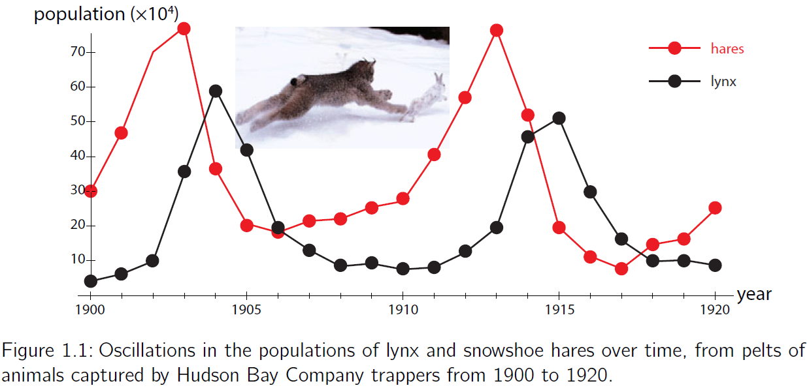
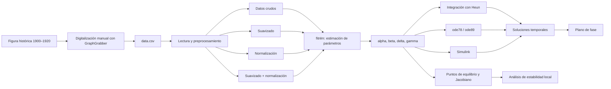

[](https://matlab.mathworks.com/open/github/v1?repo=tigremiau/MMP1)

# Práctica 1 — Modelado matemático del sistema presa–depredador de Lotka–Volterra

Repositorio académico de la asignatura **Modelado Matemático**, correspondiente a la **Maestría en Ciencias de la Ingeniería** del Tecnológico Nacional de México / Instituto Tecnológico de Tijuana. La práctica integra modelado mecanicista, análisis cualitativo de sistemas dinámicos no lineales, estimación de parámetros, simulación numérica y experimentación *in silico* en MATLAB y Simulink.

El caso de estudio utiliza el sistema clásico de **Lotka–Volterra** para representar la interacción entre una población de liebres (*snowshoe hares*) y una población de linces (*lynx*) a partir de registros históricos comprendidos entre 1900 y 1920.

**Docente:** Dr. Paul Antonio Valle Trujillo  
**Departamento:** Ingeniería Eléctrica y Electrónica  
**Institución:** Tecnológico Nacional de México / Instituto Tecnológico de Tijuana  
**Asignatura:** Modelado Matemático  
**Programa:** Maestría en Ciencias de la Ingeniería

**Alumna:** Laura Yesenia Alarcón Garvalena  16041206  16041206@itdurango.edu.mx

---

<a id="contenido"></a>
## Contenido

1. [Resumen](#resumen)
2. [Objetivos](#objetivos)
3. [Fuente y preparación de los datos](#datos)
4. [Modelo matemático](#modelo)
5. [Análisis matemático simplificado](#analisis)
6. [Estimación de parámetros](#estimacion)
7. [Métodos numéricos](#metodos)
8. [Simulación con funciones ODE de MATLAB](#odes)
9. [Simulación en Simulink](#simulink)
10. [Flujo de trabajo computacional](#flujo)
11. [Actividades y secciones del cuaderno MATLAB](#actividades)
12. [Funciones auxiliares](#funciones)
13. [Estructura del repositorio](#estructura)
14. [Requisitos](#requisitos)
15. [Reproducibilidad](#reproducibilidad)
16. [Referencias](#referencias)

---

<a id="resumen"></a>
## Resumen

Esta práctica estudia un problema inverso sencillo basado en el modelo presa–depredador de Lotka–Volterra. A partir de datos históricos digitalizados manualmente, se estiman los parámetros cinéticos del sistema mediante **regresión no lineal por mínimos cuadrados** con `fitnlm`. Para cada evaluación del modelo durante el ajuste, las ecuaciones diferenciales se resuelven numéricamente mediante el **método de Heun** con paso de integración fijo.

Posteriormente se analiza la dinámica del sistema mediante soluciones temporales y trayectorias en el plano de fase, se calculan sus puntos de equilibrio y se estudia su estabilidad local a partir de la matriz Jacobiana. Finalmente, las soluciones se comparan empleando diferentes solvers de MATLAB y Simulink, incluyendo métodos para sistemas *stiff*, *nonstiff* y de paso fijo.

**Palabras clave:** ecuaciones diferenciales ordinarias; estimación de parámetros; Lotka–Volterra; MATLAB; métodos numéricos; modelo mecanicista; regresión no lineal; sistemas dinámicos no lineales.

[Volver al contenido](#contenido)

---

<a id="objetivos"></a>
## Objetivos

### Objetivo general

Aplicar herramientas de modelado matemático, análisis de sistemas dinámicos y simulación computacional para estudiar la interacción presa–depredador descrita por el sistema de Lotka–Volterra a partir de datos históricos de liebres y linces.

### Objetivos específicos

- Digitalizar y organizar los registros experimentales como series de tiempo.
- Procesar los datos mediante suavizado y normalización.
- Estimar los parámetros \($\alpha$), \($\beta$), \($\delta$) y \($\gamma$) mediante regresión no lineal.
- Calcular estadísticos de los parámetros y criterios de bondad de ajuste.
- Resolver numéricamente el sistema mediante el método de Heun.
- Comparar diferentes solvers de MATLAB y Simulink.
- Construir las soluciones temporales y el plano de fase.
- Calcular los puntos de equilibrio y analizar su estabilidad local.
- Relacionar el análisis matemático con los resultados obtenidos mediante experimentación *in silico*.

[Volver al contenido](#contenido)

---

<a id="datos"></a>
## Fuente y preparación de los datos

Los datos corresponden a los registros históricos de liebres y linces mostrados en la Figura 1.1 de *Modeling Life: The Mathematics of Biological Systems* [2]. Los valores fueron **digitalizados manualmente** a partir de la figura mediante el software libre **GraphGrabber** y almacenados posteriormente en el archivo `data.csv`.

La figura original expresa las poblaciones en unidades de \(10^4\). Por esta razón, la función `getdata` recupera las magnitudes de población mediante

```matlab
xo = sys(:,2)*1E4;
yo = sys(:,3)*1E4;
```

El tiempo se redefine para el ajuste de manera que el primer registro corresponda a \(t=0\):

```matlab
to = round(sys(:,1));
to = to - to(1);
```



**Figura 1.** Datos históricos utilizados para construir las series de tiempo de las poblaciones de liebres y linces. Los registros fueron digitalizados manualmente con GraphGrabber a partir de la figura reportada en [2].

### Preprocesamiento considerado

El cuaderno permite analizar cuatro configuraciones del conjunto de datos:

| Configuración | Suavizado | Normalización |
|---|:---:|:---:|
| Datos crudos | No | No |
| Datos suavizados | Sí | No |
| Datos normalizados | No | Sí |
| Datos suavizados y normalizados | Sí | Sí |

El suavizado se realiza mediante una ventana gaussiana de longitud 5:

```matlab
xo = smoothdata(xo,'gaussian',5);
yo = smoothdata(yo,'gaussian',5);
```

La normalización se realiza respecto al máximo de cada población:

```matlab
xo = xo/max(xo);
yo = yo/max(yo);
```

[Volver al contenido](#contenido)

---

<a id="modelo"></a>
## Modelo matemático

El sistema presa–depredador de Lotka–Volterra se formula mediante dos ecuaciones diferenciales ordinarias no lineales de primer orden:

$$
\frac{dx}{dt}=\alpha x-\beta xy,
$$

$$
\frac{dy}{dt}=\delta xy-\gamma y,
$$

con

$$
\alpha,\beta,\delta,\gamma>0,
\qquad
x(0),y(0)\geq0.
$$

Las variables y parámetros se interpretan de la siguiente forma:

| Símbolo | Descripción |
|---|---|
| \$x(t)$   | Población de liebres o presas |
| \$y(t)$   | Población de linces o depredadores |
| \$\alpha$ | Tasa de crecimiento de la población presa en ausencia de depredadores |
| \$\beta$  | Intensidad del efecto de la interacción presa–depredador sobre las presas |
| \$\delta$ | Contribución de la interacción con las presas al crecimiento de los depredadores |
| \$\gamma$ | Tasa de mortalidad o emigración de los depredadores en ausencia de presas |

En forma vectorial,

$$
\dot{\mathbf{X}}=\mathbf{F}(\mathbf{X};\boldsymbol{\theta}),
\qquad
\mathbf{X}=\begin{bmatrix}x&y\end{bmatrix},
\qquad
\boldsymbol{\theta}=\begin{bmatrix}\alpha&\beta&\delta&\gamma\end{bmatrix}^{T}.
$$

[Volver al contenido](#contenido)

---

<a id="analisis"></a>
## Análisis matemático simplificado

### 1. Positividad e invariancia

El significado biológico del modelo requiere soluciones no negativas. Al evaluar el campo vectorial sobre las fronteras del cuadrante no negativo,

$
\left.\dot{x}\right|_{x=0}=0,
\qquad
\left.\dot{y}\right|_{y=0}=0.
$

Por lo tanto, el dominio

```math
\mathbb{R}_{+,0}^{2}
=
\left\{
(x,y)\in\mathbb{R}^{2}
\mid
x\geq 0,\; y\geq 0
\right\}
```

es positivamente invariante. Si $(x(0),y(0)\geq0)$, entonces las soluciones permanecen en el cuadrante no negativo para $\(t\geq0\)$.

### 2. Puntos de equilibrio

Los puntos de equilibrio satisfacen

$$
\alpha x-\beta xy=0,
\qquad
\delta xy-\gamma y=0,
$$

o equivalentemente,

$$
x(\alpha-\beta y)=0,
\qquad
y(\delta x-\gamma)=0.
$$

De aquí se obtienen dos equilibrios:

$$
E_0=(0,0),
$$

$$
E_1=\left(\frac{\gamma}{\delta},\frac{\alpha}{\beta}\right).
$$

El primer equilibrio corresponde a la ausencia de ambas poblaciones, mientras que $E_1$ representa la coexistencia de presas y depredadores.

### 3. Matriz Jacobiana y estabilidad local

La matriz Jacobiana es

$$
J(x,y)=
\begin{bmatrix}
\alpha-\beta y & -\beta x\\
\delta y & \delta x-\gamma
\end{bmatrix}.
$$

#### Equilibrio en el origen

Al evaluar en \(E_0=(0,0)\),

$$
J(E_0)=
\begin{bmatrix}
\alpha & 0\\
0 & -\gamma
\end{bmatrix},
$$

por lo que

$$
\lambda_1=\alpha>0,
\qquad
\lambda_2=-\gamma<0.
$$

El origen es, por tanto, un **punto silla inestable**.

#### Equilibrio de coexistencia

En

$$
E_1=\left(\frac{\gamma}{\delta},\frac{\alpha}{\beta}\right),
$$

se obtiene

$$
J(E_1)=
\begin{bmatrix}
0 & -\dfrac{\beta\gamma}{\delta}\\
\dfrac{\alpha\delta}{\beta} & 0
\end{bmatrix}.
$$

El polinomio característico es

$$
\lambda^2+\alpha\gamma=0,
$$

y sus valores propios son

$$
\lambda_{1,2}=\pm i\sqrt{\alpha\gamma}.
$$

La linealización produce valores propios puramente imaginarios. En la terminología estándar del sistema clásico de Lotka–Volterra, el equilibrio de coexistencia corresponde a un **centro**, asociado con oscilaciones sostenidas alrededor de \(E_1\); no es un equilibrio asintóticamente estable.

### 4. Normalización del sistema

Se definen las variables normalizadas

$$
x_n=\frac{x}{x_{\max}},
\qquad
y_n=\frac{y}{y_{\max}}.
$$

Como

$$
x=x_{\max}x_n,
\qquad
y=y_{\max}y_n,
$$

al sustituir en el sistema original se obtiene

$$
\frac{dx_n}{dt}=\alpha x_n-\beta_nx_ny_n,
$$

$$
\frac{dy_n}{dt}=\delta_nx_ny_n-\gamma y_n,
$$

con

$$
\beta_n=\beta y_{\max},
\qquad
\delta_n=\delta x_{\max}.
$$

Por lo tanto, los parámetros en la escala original se recuperan como

$$
\beta=\frac{\beta_n}{y_{\max}},
\qquad
\delta=\frac{\delta_n}{x_{\max}}.
$$

[Volver al contenido](#contenido)

---

<a id="estimacion"></a>
## Estimación de parámetros

Los cuatro parámetros del modelo se estiman mediante **regresión no lineal por mínimos cuadrados** utilizando `fitnlm` de MATLAB.

### Formulación computacional

Las observaciones de ambas poblaciones se agrupan en un único vector de respuesta:

```matlab
to = [to;to];
fo = [xo;yo];
```

Para cada conjunto candidato de parámetros, la función interna `model`:

1. resuelve el sistema de Lotka–Volterra mediante Heun;
2. emplea un paso fijo `dt = 1e-2`;
3. interpola las soluciones en los tiempos experimentales;
4. devuelve las predicciones apiladas \([x;y]\) a `fitnlm`.

El ajuste se ejecuta mediante

```matlab
mdl = fitnlm(to,fo,@model,p0);
```

### Estadísticos calculados

A partir del objeto `mdl`, el cuaderno obtiene:

- estimación de cada parámetro;
- error estándar (`SE`);
- margen de error (`MoE`);
- intervalo de confianza del 95 % (`CI95`);
- valor \(p\);
- grados de libertad;
- \(R^2\) ajustada;
- suma residual de cuadrados (`RSS`);
- criterio de información de Akaike corregido (`AICc`).

El margen de error se calcula como

$$
\mathrm{MoE}=t_{1-\alpha_s/2,\nu}\,SE,
$$

donde \(\alpha_s=0.05\) es el nivel de significancia y \(\nu\) representa los grados de libertad del ajuste.

### Parámetros guardados

Los parámetros estimados a partir de los datos crudos se almacenan para las simulaciones posteriores:

```matlab
par = table2array(mdl.Coefficients(:,1));
alpha = par(1);
beta  = par(2);
delta = par(3);
gamma = par(4);

save('parameters.mat','alpha','beta','delta','gamma');
```

[Volver al contenido](#contenido)

---

<a id="metodos"></a>
## Métodos numéricos

### Método de Heun

La función `LotkaVolterra` y el modelo utilizado dentro de `fitnlm` emplean el método de **Heun**, también conocido como Euler mejorado.

Para un sistema

$$
\dot{\mathbf{X}}=\mathbf{F}(\mathbf{X}),
$$

el predictor de Euler es

```math
\widetilde{\mathbf{X}}_{n+1}
=
\mathbf{X}_n+h\mathbf{F}(\mathbf{X}_n),
```

y el corrector de Heun se define como

```math
\mathbf{X}_{n+1}
=
\mathbf{X}_n+
\frac{h}{2}
\left[
\mathbf{F}(\mathbf{X}_n)
+
\mathbf{F}(\widetilde{\mathbf{X}}_{n+1})
\right].
```

En el cuaderno se implementa con `dt = 1e-2`:

```matlab
for i = 1:n % Método de Heun (Euler mejorado)
    [fx,fy] = f(x(i),y(i));

    % Predictor de Euler
    xn = x(i) + fx*dt;
    yn = y(i) + fy*dt;

    % Pendiente evaluada en el predictor
    [fxn,fyn] = f(xn,yn);

    % Corrector de Heun
    x(i+1) = x(i) + (fx + fxn)*dt/2;
    y(i+1) = y(i) + (fy + fyn)*dt/2;
end

function [dx,dy] = f(x,y)
    dx = alpha*x - beta*x*y;
    dy = delta*x*y - gamma*y;
end
```

La misma estructura numérica se utiliza dentro del problema inverso, de manera que la estimación de parámetros y la simulación directa emplean una formulación computacional consistente.

[Volver al contenido](#contenido)

---

<a id="odes"></a>
## Simulación con funciones ODE de MATLAB

Además de la integración implementada explícitamente con Heun, el cuaderno utiliza funciones ODE de MATLAB mediante una **función anónima** que transmite el vector de parámetros al campo vectorial.

### Campo vectorial

```matlab
function dV = sysODE(V,par) % V(1) = x; V(2) = y
    alpha = par(1);
    beta  = par(2);
    delta = par(3);
    gamma = par(4);

    dV = zeros(2,1);
    dV(1) = alpha*V(1) - beta*V(1)*V(2);
    dV(2) = delta*V(1)*V(2) - gamma*V(2);
end
```

### Función anónima

```matlab
par = [alpha, beta, delta, gamma];
```

La llamada

```matlab
@(t,V) sysODE(V,par)
```

permite conservar la interfaz requerida por los solvers de MATLAB y, al mismo tiempo, suministrar los parámetros estimados al modelo.

### `ode78`

```matlab
[t,fsol] = ode78(@(t,V) sysODE(V,par),[0,40],[x0,y0]);
x = fsol(:,1);
y = fsol(:,2);

figname = 'funcion_ode78';
plotphase(t,x,y,figname)
```

También se evalúa un arreglo temporal predefinido:

```matlab
tspan = (0:1E-3:40)';
[t,fsol] = ode78(@(t,V) sysODE(V,par),tspan,[x0,y0]);
```

### `ode89`

```matlab
[t,fsol] = ode89(@(t,V) sysODE(V,par),[0,40],[x0,y0]);
x = fsol(:,1);
y = fsol(:,2);

figname = 'funcion_ode89';
plotphase(t,x,y,figname)
```

Con arreglo temporal predefinido:

```matlab
tspan = (0:1E-3:40)';
[t,fsol] = ode89(@(t,V) sysODE(V,par),tspan,[x0,y0]);
```

[Volver al contenido](#contenido)

---

<a id="simulink"></a>
## Simulación en Simulink

El modelo también se implementa como un diagrama de bloques en `sistema.slx`. Los parámetros estimados y las condiciones iniciales se transfieren desde MATLAB mediante `set_param`:

```matlab
set_param('sistema/alpha','Value',num2str(alpha))
set_param('sistema/beta','Value',num2str(beta))
set_param('sistema/delta','Value',num2str(delta))
set_param('sistema/gamma','Value',num2str(gamma))
set_param('sistema/x0','Value',num2str(x0))
set_param('sistema/y0','Value',num2str(y0))
```

El cuaderno compara las siguientes familias de solvers.

### Solvers para ecuaciones *stiff*

- `ode15s`
- `ode23s`
- `ode23t`
- `ode23tb`

### Solvers para ecuaciones *nonstiff*

- `ode45`
- `ode23`
- `ode113`

### Solvers de paso fijo

- `ode1` — Euler
- `ode2` — Heun
- `ode3` — Bogacki–Shampine
- `ode4` — Runge–Kutta
- `ode5` — Dormand–Prince

Como evaluación adicional, `ode23tb` se ejecuta especificando un paso máximo:

```matlab
parameters.MaxStep = '0.1';
parameters.Solver = 'ode23tb';
f = sim(filesim,parameters);
```

[Volver al contenido](#contenido)

---

<a id="flujo"></a>
## Flujo de trabajo computacional



El flujo refleja el vínculo entre los datos, el problema inverso, la solución numérica del modelo y el análisis cualitativo del sistema dinámico.

[Volver al contenido](#contenido)

---

<a id="actividades"></a>
## Actividades y secciones del cuaderno MATLAB

El archivo `Apellido_NoControl.mlx` constituye el cuaderno computacional principal. Las actividades deben desarrollarse siguiendo **todas las secciones y subsecciones** incluidas en el documento.

### 1. Información general

- Nombre del alumno.
- Número de control.
- Correo institucional.
- Asignatura: Modelado Matemático.
- Docente.

### 2. Datos experimentales y ajuste

#### 2.1 Datos crudos

- Lectura de `data.csv`.
- Gráfica de las series de tiempo.
- Ajuste mediante `fitnlm`.
- Estimación de \(\alpha,\beta,\delta,\gamma\).
- Cálculo de estadísticos y criterios de bondad de ajuste.
- Almacenamiento de `parameters.mat`.
- Comparación datos–modelo.

#### 2.2 Datos suavizados

- Suavizado gaussiano.
- Ajuste de parámetros.
- Simulación con los parámetros estimados.
- Comparación datos–modelo.

#### 2.3 Datos normalizados

- Normalización de cada población respecto a su valor máximo.
- Ajuste de parámetros sobre las variables normalizadas.
- Simulación y comparación datos–modelo.

##### 2.3.1 Desnormalización de los parámetros

- Recuperación de \(\beta\) y \(\delta\) en la escala original.
- Simulación del modelo desnormalizado.
- Comparación con los datos originales.

#### 2.4 Datos suavizados y normalizados

- Aplicación conjunta de suavizado y normalización.
- Ajuste de parámetros.
- Simulación y comparación datos–modelo.

### 3. Soluciones y plano de fase

- Carga de los parámetros estimados.
- Simulación del sistema mediante `LotkaVolterra`.
- Soluciones \(x(t)\) y \(y(t)\).
- Trayectoria \(y(x)\) en el plano de fase.

### 4. Modelos de EDOs con Simulink

#### 4.1 Funciones ODE para ecuaciones *stiff*

- Función `ode15s`.
- Función `ode23s`.
- Función `ode23t`.
- Función `ode23tb`.

#### 4.2 Funciones ODE para ecuaciones *nonstiff*

- Función `ode45`.
- Función `ode23`.
- Función `ode113`.

#### 4.3 Funciones ODE con paso de integración fijo

- Función `ode1`.
- Función `ode2`.
- Función `ode3`.
- Función `ode4`.
- Función `ode5`.

#### 4.4 Función ODE seleccionada

- `ode23tb` con especificación de `MaxStep`.

### 5. Funciones anónimas

#### 5.1 Función `ode78`

- Integración utilizando un intervalo temporal.

#### 5.2 `ode78` con arreglo predefinido del tiempo

- Integración utilizando `tspan = (0:1E-3:40)'`.

#### 5.3 Función `ode89`

- Integración utilizando un intervalo temporal.

#### 5.4 `ode89` con arreglo predefinido del tiempo

- Integración utilizando `tspan = (0:1E-3:40)'`.

#### 5.5 Modelo matemático

- Implementación del campo vectorial mediante `sysODE`.

### 6. Estabilidad de los equilibrios

#### 6.1 Condiciones iniciales: origen

- Simulación exactamente en \(E_0=(0,0)\).
- Simulación con condiciones iniciales alejadas del origen.
- Representación del equilibrio en el plano de fase.

#### 6.2 Condiciones iniciales: equilibrio de especies

- Cálculo de

$$
E_1=\left(\frac{\gamma}{\delta},\frac{\alpha}{\beta}\right).
$$

- Simulación con perturbaciones alrededor del equilibrio de coexistencia.
- Comparación de trayectorias en el plano de fase.

### 7. Funciones

- `getdata`
- `plotsys`
- `fitmodel`
- `plotfitting`
- `LotkaVolterra`
- `plotphase`

[Volver al contenido](#contenido)

---

<a id="funciones"></a>
## Funciones auxiliares

| Función | Propósito |
|---|---|
| `getdata` | Lee `data.csv`, redefine el origen temporal, convierte las poblaciones a individuos y aplica suavizado y/o normalización |
| `plotsys` | Grafica las series temporales y exporta la figura en PDF vectorial |
| `fitmodel` | Resuelve el problema inverso con `fitnlm`, integra el sistema mediante Heun y calcula los estadísticos del ajuste |
| `plotfitting` | Compara gráficamente los datos experimentales con las soluciones obtenidas a partir de los parámetros estimados |
| `LotkaVolterra` | Integra el sistema presa–depredador mediante Heun con `dt = 1e-2` |
| `plotphase` | Grafica \(x(t)\), \(y(t)\) y la trayectoria en el plano de fase, y exporta el resultado en PDF vectorial |
| `sysODE` | Define el campo vectorial para utilizarlo con los solvers ODE de MATLAB |

[Volver al contenido](#contenido)

---

<a id="estructura"></a>
## Estructura del repositorio

La estructura esperada para reproducir completamente la práctica es:

```text
.
├── README.md
├── Apellido_NoControl.mlx       # Cuaderno computacional principal
├── data.csv                     # Series de tiempo digitalizadas
├── data.png                     # Figura de referencia de los datos
├── sistema.slx                  # Modelo presa–depredador en Simulink
├── parameters.mat               # Parámetros estimados a partir de los datos crudos
├── Valle05211261.tex            # Desarrollo matemático de referencia
└── *.pdf                        # Figuras vectoriales generadas por MATLAB
```

Los archivos PDF son generados con `exportgraphics(...,'ContentType','vector')` durante las diferentes etapas de procesamiento, ajuste, simulación y análisis del plano de fase.

[Volver al contenido](#contenido)

---

<a id="requisitos"></a>
## Requisitos

Para ejecutar todas las secciones del repositorio se requiere:

- MATLAB.
- Statistics and Machine Learning Toolbox.
  - `fitnlm`
  - `coefCI`
  - `tinv`
- Simulink.
- Una versión de MATLAB que incluya `ode78` y `ode89`.

[Volver al contenido](#contenido)

---

<a id="reproducibilidad"></a>
## Reproducibilidad

Para reproducir el análisis completo:

1. Colocar `data.csv`, `Apellido_NoControl.mlx` y `sistema.slx` en el mismo directorio de trabajo de MATLAB.
2. Ejecutar primero la sección **Datos experimentales y ajuste → Datos crudos**.
3. Verificar que se genere `parameters.mat` con \(\alpha\), \(\beta\), \(\delta\) y \(\gamma\).
4. Ejecutar las configuraciones de suavizado y normalización.
5. Ejecutar **Soluciones y plano de fase**.
6. Ejecutar las comparaciones de solvers en **Modelos de EDOs con Simulink**.
7. Ejecutar las simulaciones con `ode78` y `ode89`.
8. Ejecutar **Estabilidad de los equilibrios** y relacionar los resultados numéricos con el análisis matemático.
9. Conservar las figuras PDF generadas como evidencia de las simulaciones realizadas.

### Resultados mínimos esperados

Al finalizar la práctica, el repositorio debe contener o permitir generar:

- parámetros estimados del modelo;
- tabla de estadísticos de los parámetros;
- \(R^2\) ajustada, RSS y AICc;
- gráficas de los datos crudos, suavizados y normalizados;
- comparaciones entre datos y modelo ajustado;
- soluciones temporales de ambas poblaciones;
- trayectorias en el plano de fase;
- simulaciones con diferentes solvers;
- análisis computacional de los equilibrios;
- figuras vectoriales en formato PDF.

[Volver al contenido](#contenido)

---

<a id="referencias"></a>
## Referencias

[1] P. A. Valle, *Syllabus para Biología de Sistemas y Gemelos Digitales*, Tecnológico Nacional de México / Instituto Tecnológico de Tijuana, Tijuana, B.C., México, 2026. Disponible en: https://biomath.xyz/course/

[2] A. Garfinkel, J. Shevtsov y Y. Guo, *Modeling Life: The Mathematics of Biological Systems*. Springer International Publishing, 2017. https://doi.org/10.1007/978-3-319-59731-7

---

## Uso académico

Este repositorio se utiliza con fines docentes en la asignatura **Modelado Matemático** de la **Maestría en Ciencias de la Ingeniería**. El cuaderno computacional debe complementarse con la interpretación matemática y física de los resultados; la ejecución del código por sí sola no sustituye el análisis del sistema dinámico.
